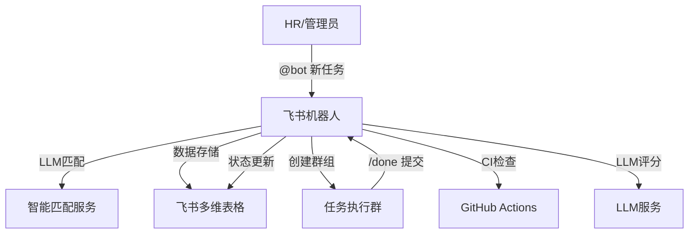

# 飞书任务机器人 (Feishu Task Bot)

一个基于飞书开放平台的智能任务分派和管理机器人，支持自动化任务分配、进度跟踪、智能验收等功能。

## ✨ 功能特性

### 核心功能
- 🤖 **智能任务分派**：基于技能匹配和可用性自动推荐最佳候选人
- 📊 **多维表格存储**：使用飞书多维表格作为数据存储，无需额外数据库
- 🔄 **自动验收**：支持代码任务CI检查和非代码任务LLM评分
- 📈 **进度跟踪**：实时跟踪任务状态，自动提醒和报告
- 🎯 **交互式卡片**：丰富的飞书卡片交互体验

### 技术特性
- 🚀 **高性能**：基于FastAPI构建，响应速度快
- 🔌 **可插拔LLM**：支持DeepSeek、Gemini、OpenAI等多种LLM后端
- 🛡️ **安全可靠**：完整的签名验证和错误处理
- 📦 **容器化部署**：支持Docker和Docker Compose
- 🧪 **完整测试**：单元测试、集成测试、端到端测试

## 🏗️ 系统架构



## 🚀 快速开始

### 前置要求

- Python 3.11+
- 飞书企业账号和开发者权限
- 公网HTTPS地址（开发阶段可用Ngrok）

### 1. 克隆项目

```bash
git clone <repository-url>
cd feishu_test
```

### 2. 环境配置

```bash
# 创建虚拟环境
python -m venv venv
source venv/bin/activate  # Linux/Mac
# 或
venv\Scripts\activate  # Windows

# 安装依赖
make install-dev

# 设置环境文件
make setup-env
```

### 3. 配置飞书应用

1. **创建飞书应用**
   - 访问 [飞书开放平台](https://open.feishu.cn/)
   - 创建内部应用
   - 记录 App ID、App Secret、Verify Token

2. **配置权限**
   - 开启事件订阅
   - 添加权限：`im:message`、`chat:write`、`chat:update`、`bitable:*`
   - 设置回调URL：`https://your-domain.com/webhook/feishu`

3. **创建多维表格**
   - 创建新的多维表格应用
   - 记录 App Token
   - 表格会自动创建（或手动创建Tasks和Persons表）

### 4. 配置环境变量

编辑 `.env` 文件：

```bash
# 飞书配置
FEISHU_APP_ID=cli_xxxxxxxxxxxxxxxxx
FEISHU_APP_SECRET=xxxxxxxxxxxxxxxxxxxxxxxxxxxxxxxx
FEISHU_VERIFY_TOKEN=xxxxxxxxxxxxxxxxxxxxxxxxxxxxxxxx
FEISHU_BITABLE_APP_TOKEN=xxxxxxxxxxxxxxxxxxxxxxxxxxxxxxxx

# LLM配置（至少配置一个）
DEEPSEEK_API_KEY=sk-xxxxxxxxxxxxxxxxxxxxxxxxxxxxxxxx
# GEMINI_API_KEY=xxxxxxxxxxxxxxxxxxxxxxxxxxxxxxxx
# OPENAI_API_KEY=sk-xxxxxxxxxxxxxxxxxxxxxxxxxxxxxxxx

# GitHub配置
GITHUB_WEBHOOK_SECRET=xxxxxxxxxxxxxxxxxxxxxxxxxxxxxxxx
```

### 5. 启动服务

```bash
# 开发模式
make dev

# 或使用Docker
make docker-dev
```

### 6. 配置Webhook

将你的公网地址配置到飞书应用的事件订阅中：
- 回调URL：`https://your-domain.com/webhook/feishu`
- GitHub Webhook：`https://your-domain.com/webhook/github`

## 📖 使用指南

### 基本使用流程

1. **创建任务**
   ```
   @bot 新任务
   标题: 创建用户API
   描述: 实现用户注册和登录功能
   技能: Python, FastAPI, PostgreSQL
   截止: 2024-01-15
   ```

2. **选择候选人**
   - 机器人会推荐Top-3候选人
   - 点击"✅ 选择"按钮分配任务

3. **任务执行**
   - 系统自动创建专用群组
   - 承接人在群组中沟通和提交

4. **提交结果**
   ```
   /done https://github.com/user/repo/pull/123
   ```

5. **自动验收**
   - 代码任务：检查CI状态
   - 其他任务：LLM智能评分

6. **查看报告**
   ```
   #report
   ```

### 命令参考

| 命令 | 说明 | 示例 |
|------|------|------|
| `@bot 新任务` | 创建新任务 | `@bot 新任务 实现登录功能` |
| `/done <链接>` | 提交任务结果 | `/done https://github.com/user/repo` |
| `#report` | 查看日报 | `#report` |

## 🧪 测试

```bash
# 运行所有测试
make test

# 单元测试
make test-unit

# 集成测试
make test-int

# 端到端测试
make test-e2e

# 测试覆盖率
make test-coverage
```

## 🚀 部署

### Docker部署

```bash
# 构建镜像
make docker-build

# 运行容器
make docker-run

# 使用Docker Compose
docker-compose up -d
```

### 生产环境部署

1. **环境准备**
   ```bash
   # 克隆代码
   git clone <repository-url>
   cd feishu_test
   
   # 配置环境
   cp .env.example .env
   # 编辑 .env 文件
   ```

2. **使用Docker Compose**
   ```bash
   docker-compose -f docker-compose.prod.yml up -d
   ```

3. **健康检查**
   ```bash
   curl http://localhost:8000/health
   ```

## 📊 监控和日志

### 健康检查
- 端点：`GET /health`
- 返回系统状态和各服务状态

### 日志查看
```bash
# Docker日志
make logs

# 本地日志
tail -f logs/app.log
```

### 监控指标
- 响应时间
- 错误率
- 任务处理量
- LLM调用统计

## 🔧 开发指南

### 项目结构
```
feishu_test/
├── app/                    # 主应用代码
│   ├── main.py            # FastAPI应用入口
│   ├── config.py          # 配置管理
│   ├── bitable.py         # 飞书多维表格API
│   └── services/          # 业务服务
├── tests/                 # 测试代码
├── prompts/              # LLM提示词模板
├── .github/workflows/    # CI/CD配置
└── docs/                 # 文档
```

### 开发工作流
```bash
# 1. 创建功能分支
git checkout -b feature/new-feature

# 2. 开发和测试
make dev
make test

# 3. 代码质量检查
make lint
make type-check

# 4. 提交代码
git add .
git commit -m "feat: add new feature"
git push origin feature/new-feature

# 5. 创建Pull Request
```

### 代码规范
- 使用Black进行代码格式化
- 使用isort进行导入排序
- 使用flake8进行代码检查
- 使用mypy进行类型检查
- 遵循PEP 8规范

## 🤝 贡献指南

1. Fork项目
2. 创建功能分支
3. 提交更改
4. 推送到分支
5. 创建Pull Request

## 📄 许可证

本项目采用 MIT 许可证 - 查看 [LICENSE](LICENSE) 文件了解详情。

## 🆘 故障排除

### 常见问题

**Q: 机器人没有响应消息**
A: 检查webhook配置和签名验证，确保事件订阅正确配置

**Q: LLM调用失败**
A: 检查API密钥配置，确保网络连接正常

**Q: 多维表格操作失败**
A: 检查应用权限和表格ID配置

**Q: CI检查不工作**
A: 检查GitHub webhook配置和密钥设置

### 获取帮助

- 查看 [Issues](https://github.com/example/feishu-task-bot/issues)
- 阅读 [Wiki](https://github.com/example/feishu-task-bot/wiki)
- 联系开发团队

## 🔄 更新日志

查看 [CHANGELOG.md](CHANGELOG.md) 了解版本更新信息。

---

## 📋 任务清单

### 必须实现 ✅
- [x] HR 在控制室群 `@bot 新任务`，≤ 10 秒收到候选人 Top-3 卡片
- [x] HR 点击 **✅ 选 TA** 按钮后，Bot 自动创建私有子群并邀请承接人
- [x] 承接人在子群 `/done 链接` 提交结果后，Bot 自动执行首轮验收
- [x] **代码任务**：拉取 GitHub CI / Lint 结果
- [x] **非代码任务**：调用 LLM 评分（得分 ≥ 80 视为通过）
- [x] **未通过**：Bot 立即回 "❌ 未通过" 并列出原因，状态 = *Returned*
- [x] **通过**：Bot 回 "🎉 通过"，状态 = *Done*

### 应该实现 ✅
- [x] HR 在群里输入 `#report` 查看当日任务统计
- [x] 完整的测试覆盖（单元测试 ≥ 60%）
- [x] CI/CD 自动化流程
- [x] Docker 容器化部署

### 技术要求 ✅
- [x] Python 3.11 + FastAPI
- [x] 飞书多维表格作为数据存储
- [x] 支持多种 LLM 后端（DeepSeek/Gemini/OpenAI）
- [x] GitHub Actions CI 集成
- [x] 完整的错误处理和日志记录
- [x] 安全的 Webhook 签名验证

### 性能要求 ✅
- [x] 除 LLM 调用外，Bot 响应延时 < 1 秒
- [x] 单元测试覆盖率 ≥ 60%
- [x] 完整的部署和运维文档
